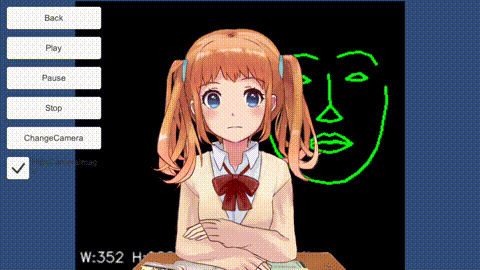

DlibFaceLandmarkDetectorWithLive2DSample
====================

Overview
-----
<http://qiita.com/utibenkei/items/15925db826721f6bb00c>  

Screen Shot
-----

Environment
-----
Windows 8.1  
Unity 5.3.0f4  
OpenCVForUnity2.0.9  
DlibFaceLandmarkDetector1.0.3 (and DlibFaceLandmarkDetectorWithOpenCVSample)  
Live2D version 2.1.02 for Unity  

Setup
-----
* Create New Project. (DlibFaceLandmarkDetectorWithLive2DSample)
* Import OpenCVForUnity from AssetStore  
* Import DlibFaceLandmarkDetector from AssetStore  
* Import DlibFaceLandmarkDetectorWithOpenCVSample
* Move the "shape_predictor_68_face_landmarks.dat" file to the "Assets/StreamingAssets" folder.
* Import Live2D SDK
* Move the "Live2D_SDK_Unity/sample/SampleApp1/Assets/Resources/live2d/shizuku" folder to the "Assets/StreamingAssets" folder.
* Import DlibFaceLandmarkDetectorWithLive2DSample.unitypackage 
* Change Product Name. (DlibFaceLandmarkDetectorWithLive2DSample)  
* Change PlayerSettings.bundleIdentifier. (xxx.xxxxxxx.DlibFaceLandmarkDetectorWithLive2DSample)  
* Add the "Assets/DlibFaceLandmarkDetectorWithLive2DSample/Scenes/*.unity" files to "Scenes In Build" list in "Build Settings" window.

Demo
-----
- WebGL
<https://utibenkei.github.io/DlibFaceLandmarkDetectorWithLive2DSample/webgl_sample/index.html>
- Android
<http://utibenkei.bitbucket.org/dlibfacelandmarkdetectorwithlive2dsample_543.apk>

